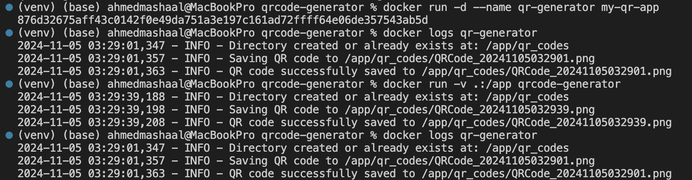

# QR Code Generator with Docker and Python

This project combines Docker and Python to create a program that generates a QR code in PNG format containing a URL. The QR code can be scanned using a phone camera to navigate directly to the specified website. The default QR code generated links to my GitHub homepage.

## Setup

1. **Install Docker**: [Get Docker](https://www.docker.com/get-started/)
2. **Sign Up for a Docker Account** if you don't have one already.

## How to Build and Run

### Build the Docker Image

Build the Docker image using the following command (make sure you’re in the directory containing the Dockerfile):

```bash
docker build -t my-qr-app .
```

This command creates a Docker image named `my-qr-app`.

### Run the Docker Container

Run the container to generate a QR code linking to a specified URL or using the default GitHub URL.

- **Using the Default URL**:
  
  ```bash
  docker run -d --name qr-generator -v "$(pwd)/qr_codes:/app/qr_codes" my-qr-app
  ```

  This command creates a QR code with the default URL (`https://github.com/mashal99`) and saves it in the `qr_codes` directory.

- **Using a Custom URL**:

  ```bash
  docker run -d --name qr-generator -v "$(pwd)/qr_codes:/app/qr_codes" my-qr-app --url "https://custom-url.com"
  ```

### Customization Options

You can customize the QR code by setting environment variables when running the container:

```bash
docker run -d --name qr-generator   -e QR_DATA_URL='https://example.com'   -e QR_CODE_DIR='qr_codes'   -e QR_CODE_FILENAME='exampleQR.png'   -e FILL_COLOR='blue'   -e BACK_COLOR='yellow'   -v "$(pwd)/qr_codes:/app/qr_codes"   my-qr-app
```

## Submission Requirements

- **QR Code Image**: Below is the generated QR code image linking to my GitHub homepage.
  

- **Log Output**: Below is a screenshot of the log showing the successful creation of the QR code.
  

## Useful Docker Commands

- **Building the Image**: `docker build -t my-qr-app .`
- **Running a Container**: `docker run -d --name qr-generator my-qr-app`
- **Listing Running Containers**: `docker ps`
- **Stopping a Container**: `docker stop qr-generator`
- **Removing a Container**: `docker rm qr-generator`
- **Viewing Logs**: `docker logs qr-generator`
- **Removing an Image**: `docker rmi my-qr-app`